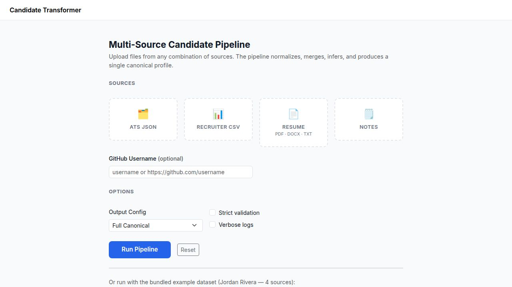
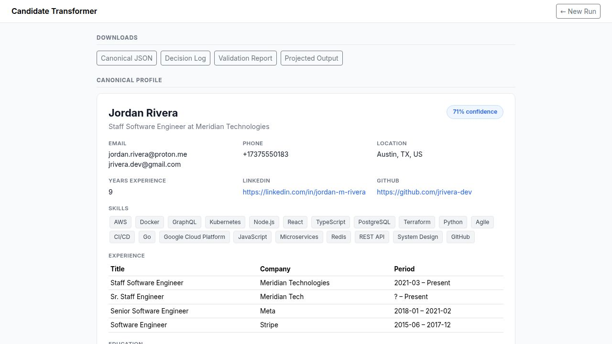

# Candidate Transformer

> A Node.js pipeline that ingests candidate data from up to five sources, resolves conflicts, infers missing fields, and emits a single **canonical profile** — with confidence scoring, full provenance, a decision log, and schema validation.

 🎬 **Demo Video:** [Watch here](#)



---

## Table of Contents

1. [Features](#features)
2. [Result Screenshot](#result-screenshot)
3. [Project Structure](#project-structure)
4. [Tech Stack](#tech-stack)
5. [Quick Start](#quick-start)
6. [Input Sources](#input-sources)
7. [Pipeline Stages](#pipeline-stages)
8. [Source Priority](#source-priority)
9. [Canonical Schema](#canonical-schema)
10. [Edge Cases](#edge-cases)
11. [Design Decisions](#design-decisions)

---

## Features

| Feature | Detail |
|---|---|
| **5 source types** | ATS JSON · Recruiter CSV · Resume (TXT/PDF/DOCX) · Notes TXT · GitHub API |
| **Normalisation** | Phones → E.164 · Emails → lowercase · Dates → ISO-8601 · Skills → canonical aliases |
| **Conflict resolution** | Priority-weighted scalars; union+dedup for lists; all conflicts recorded |
| **Provenance** | Every field tagged with its winning source and extraction method |
| **Confidence score** | 0–1 float; penalised for missing required fields |
| **Schema validation** | AJV JSON Schema; strict or permissive mode |
| **Output projection** | Full canonical or custom field subset via runtime config |
| **Robust** | Any source can be missing or malformed — pipeline continues gracefully |

---

## Result Screenshot



---

## Project Structure

```
candidate-transformer/
├── app.js                        # Express server & routes
├── src/
│   ├── pipeline.js               # Orchestrates all 10 stages
│   ├── merger.js                 # Conflict resolution & provenance
│   ├── inference.js              # Derives years_experience, seniority
│   ├── confidence.js             # Scores 0–1 based on field coverage
│   ├── validator.js              # AJV JSON Schema validation
│   ├── projector.js              # Applies output config (full / custom)
│   ├── loaders/
│   │   ├── AtsLoader.js          # ATS JSON
│   │   ├── CsvLoader.js          # Recruiter CSV
│   │   ├── ResumeLoader.js       # TXT / PDF / DOCX
│   │   ├── NotesLoader.js        # Free-text notes
│   │   └── GitHubLoader.js       # GitHub REST API
│   ├── normalizers/
│   │   ├── phoneNormalizer.js    # → E.164
│   │   ├── emailNormalizer.js    # → lowercase
│   │   ├── skillsNormalizer.js   # alias map (130+ entries)
│   │   ├── dateNormalizer.js     # → ISO-8601
│   │   └── urlNormalizer.js      # strip www / protocol
│   ├── schemas/
│   │   └── canonicalSchema.json  # AJV JSON Schema definition
│   └── utils/
│       └── logger.js             # Structured logger (LOG_LEVEL env)
├── views/
│   ├── index.ejs                 # Upload page
│   └── result.ejs                # Single-scroll result page
├── examples/                     # Jordan Rivera — 4-source demo dataset
│   └── robustness/               # Corrupted / empty / edge-case files
├── configs/
│   ├── default_config.json       # Full canonical output
│   └── custom_config.json        # Custom field subset
└── output/                       # Generated at runtime (git-ignored)
```

---

## Tech Stack

| Layer | Technology |
|---|---|
| **Server** | Node.js · Express |
| **Templating** | EJS |
| **File upload** | Multer |
| **Phone normalisation** | libphonenumber-js |
| **CSV parsing** | csv-parse |
| **Schema validation** | AJV |
| **Styling** | Bootstrap 5 · Custom CSS |

---

## Quick Start

```bash
npm install
npm start          # → http://localhost:5000
```

Click **Run Example** to process the bundled Jordan Rivera dataset (4 sources, realistic inconsistencies).

**Or via curl:**
```bash
# Run example dataset
curl -X POST http://localhost:5000/run-examples -d "config=default"

# View last result (GET, no re-run)
curl http://localhost:5000/last-result

# Download outputs
curl http://localhost:5000/download/canonical     -o canonical.json
curl http://localhost:5000/download/decision_log  -o decision_log.json
```

---

## Input Sources

| Source | Format | Notes |
|---|---|---|
| ATS export | `.json` | Authoritative system of record |
| Recruiter spreadsheet | `.csv` | Structured human entry |
| Résumé | `.txt` / `.pdf` / `.docx` | Candidate self-reported |
| Recruiter notes | `.txt` | Free-text, parsed with regex |
| GitHub | username or URL | Public API, unauthenticated (60 req/hr) |

---

## Pipeline Stages

| # | Stage | What happens |
|---|---|---|
| 1 | **Load** | Each loader reads its source, returns a `PartialProfile` |
| 2 | **Extract** | Structured fields pulled from raw text |
| 3 | **Normalise** | Phones → E.164, emails → lowercase, skill aliases resolved |
| 4 | **Match & Group** | Strong-signal count matching groups records by person |
| 5 | **Merge** | Priority-weighted scalars, union+dedup lists, conflicts logged |
| 6 | **Infer** | `years_experience` from dates, `seniority_level` from title keywords |
| 7 | **Confidence** | 0–1 score based on field coverage |
| 8 | **Validate** | AJV JSON Schema check |
| 9 | **Project** | Apply output config (full or custom field subset) |
| 10 | **Export** | Write `canonical.json`, `decision_log.json`, `validation.json` |

---

## Source Priority

For **scalar fields** (name, headline, title) the highest-priority non-null source wins. For **list fields** (emails, phones, skills, experience) all sources contribute and results are unioned + deduplicated.

| Priority | Source | Rationale |
|---|---|---|
| 1 | ATS JSON | Authoritative system of record |
| 2 | Recruiter CSV | Structured human entry |
| 3 | Resume | Candidate self-reported |
| 4 | GitHub | Public, verifiable |
| 5 | Notes | Subjective free-text |

---

## Canonical Schema

| Field | Type | Notes |
|---|---|---|
| `candidate_id` | `string` | From ATS or derived |
| `full_name` | `string\|null` | |
| `emails` | `string[]` | Lowercase, deduplicated |
| `phones` | `string[]` | E.164 format |
| `location` | `{city, state, country}\|null` | |
| `linkedin_url` | `string\|null` | www-stripped |
| `github_url` | `string\|null` | |
| `years_experience` | `number\|null` | Max across sources |
| `seniority_level` | `string\|null` | Inferred from title |
| `skills` | `string[]` | Canonical names, deduplicated |
| `work_experience` | `object[]` | Dates: YYYY-MM |
| `education` | `object[]` | |
| `confidence` | `number` | 0.0–1.0 |
| `provenance` | `object` | Field → source mapping |
| `decision_log` | `object[]` | All conflicts with old/new/reason |

---

## Edge Cases

| Scenario | Handling |
|---|---|
| Missing source file | Loader logs warning, returns `null`; pipeline continues |
| Malformed JSON / CSV | Parser error caught, empty partial returned |
| Conflicting names | ATS name wins; lower-priority names recorded in provenance |
| Phone without country code | US default (`+1`) applied; if invalid → `null` |
| `"Present"` / `"Current"` end date | Mapped to `null` (ongoing role) |
| Duplicate skills (`JS` / `JavaScript`) | Alias map → single canonical `JavaScript` |
| All sources fail or are malformed | Pipeline throws with a descriptive error; partial sources still contribute |

---

## Design Decisions

**Count-based matching over ratio scoring** — ratio scoring collapses below the merge threshold when format differences exist (e.g. `+1-737-555-0183` vs `(737) 555-0183`). Instead, signals are normalised first and then counted: 2+ strong signals (email / phone / profile URL) → merge; 1 signal + name → merge; otherwise keep separate.

**Last-writer-wins with full audit** — rather than a silent winner, every conflict is written to `decision_log` with the old value, new value, source, and reason. Nothing is silently discarded.

**Single-scroll result page, no tabs** — tabs hide content users need to see. The result page renders the full profile, decision log, provenance, and validation in one linear scroll, with `<pre>` for the raw JSON (no JS dependency).

**`null` over invention** — if a field cannot be reliably extracted, it is `null`. The confidence score communicates how complete the profile is rather than filling gaps with guesses.

